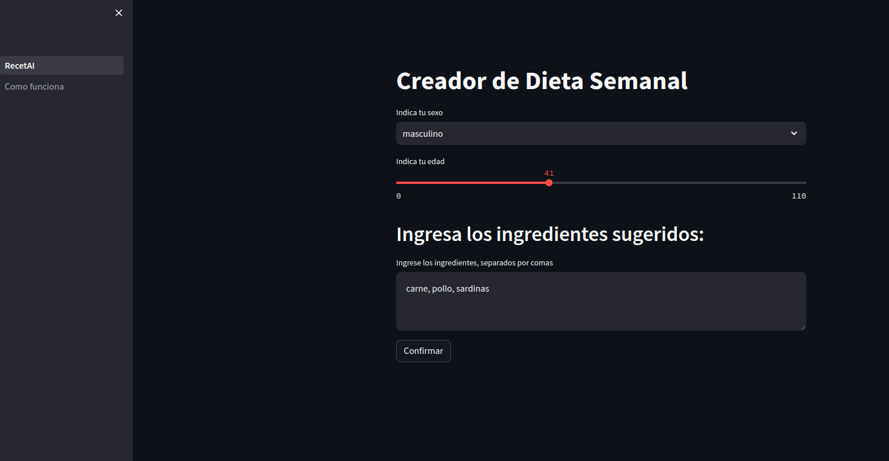

# RECET AI

page deployed: https://receta.streamlit.app/

# How to start the project:

If you want to see the page for yourself, you'll need to do the following:

- Clone the repository 

- Open in Github Codespaces

- Add your openai key in env.py

- Run: streamlit run RecetAI.py --server.enableCORS false --server.enableXsrfProtection false

# Previews

### Home page:

